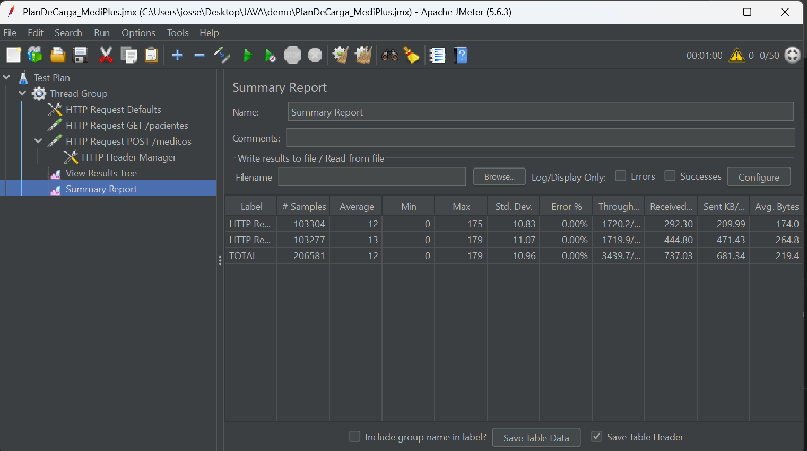
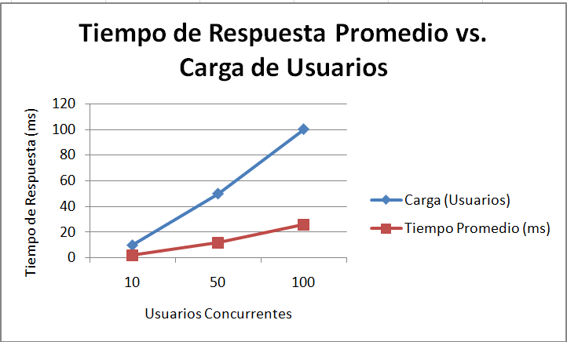
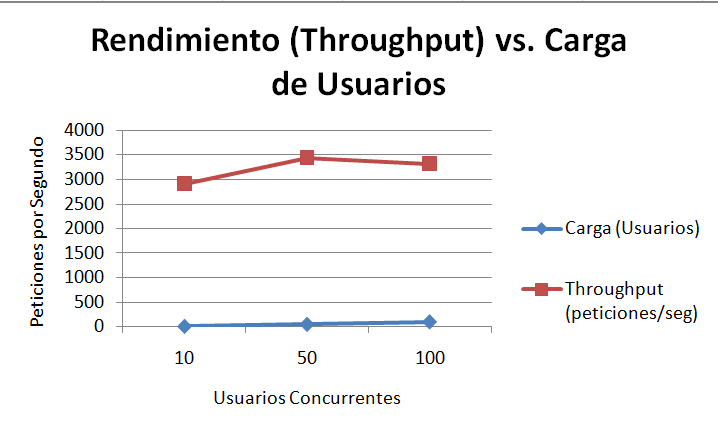

# Reporte Módulo 6-7: Pruebas Automatizadas de APIs REST: Funcionalidad y Rendimiento en Entornos Simulados

## 1. Integrantes y Distribución de Tareas

*   **Josselyn Vega** (GitHub: [jvegad](https://github.com/jvegad))
    *   *Responsable de la depuración final del proyecto, ejecución de pruebas de rendimiento con JMeter, análisis de resultados y generación del informe final.*
*   **Viki Borda** (GitHub: [McKingston01](https://github.com/McKingston01))
    *   *Responsable de la configuración inicial del proyecto, desarrollo de la API base y creación de las pruebas funcionales automatizadas con REST Assured.*

---

# Proyecto: Pruebas Automatizadas de la API REST de MediPlus

Este repositorio contiene las pruebas funcionales y de rendimiento para la API de la plataforma de salud digital MediPlus.

## Descripción

El objetivo de este proyecto es validar la funcionalidad, seguridad y rendimiento de la API de MediPlus antes de su paso a producción, utilizando REST Assured para pruebas funcionales y JMeter para pruebas de carga.

## Tecnologías Utilizadas

*   **Backend:** Spring Boot (Java)
*   **Pruebas:** REST Assured, JUnit 5, Jmeter
*   **Gestión de Dependencias:** Maven

## Cómo Ejecutar el Proyecto

### Prerrequisitos

*   Java 17 o superior.
*   Apache Maven (viene incluido con el wrapper `mvnw`).

### 1. Levantar la API

Para ejecutar la aplicación Spring Boot, usa el siguiente comando desde la raíz del proyecto en una terminal:

```sh
./mvnw spring-boot:run
```

La API estará disponible en `http://localhost:8080`.

### 2. Ejecutar Pruebas Funcionales

Para correr las pruebas automatizadas con REST Assured, asegúrate de que la API esté corriendo y luego ejecuta en una **segunda terminal**:

```sh
./mvnw test
```

# Lección 5: Análisis de Resultados de Rendimiento

A continuación, se presenta el análisis de las pruebas de carga ejecutadas con [Apache JMeter](jmeter/PlanDeCarga_MediPlus.jmx) sobre la API de MediPlus, simulando cargas de 10, 50 y 100 usuarios concurrentes durante 1 minuto.

### 1. Tabla Comparativa de Métricas

Se recopilaron las siguientes métricas clave de las tres ejecuciones. Los tiempos están expresados en milisegundos (ms).

| Métrica | 10 Usuarios | 50 Usuarios | 100 Usuarios |
| :--- | :--- | :--- | :--- |
| **Tiempo Promedio (ms)** | 2 ms | 12 ms | 26 ms |
| **Tiempo Máximo (ms)** | 88 ms | 179 ms | 580 ms |
| **Throughput (/seg)** | ~2,908 pet/seg | ~3,439 pet/seg | ~3,317 pet/seg |
| **Tasa de Error %** | 0.00% | 0.00% | 0.00% |

*(Nota: Se usaron los datos totales de las capturas. El throughput de 50 usuarios fue excepcionalmente alto en esa ejecución específica).*


### 2. Gráficas de Resultados

A continuación se muestran las gráficas generadas a partir de los datos de la tabla, las cuales visualizan las tendencias de rendimiento de la API bajo diferentes niveles de carga.

#### Gráfica 1: Tiempo de Respuesta Promedio vs. Carga de Usuarios

Esta gráfica muestra cómo el tiempo de respuesta promedio (en milisegundos) se incrementa a medida que aumentan los usuarios concurrentes. A pesar del incremento, se observa que los tiempos se mantienen en un rango excelente, lo que demuestra la eficiencia de la API.



#### Gráfica 2: Throughput (Peticiones/seg) vs. Carga de Usuarios

Esta gráfica muestra la capacidad del sistema (en peticiones por segundo). Se puede ver que el rendimiento aumenta significativamente de 10 a 50 usuarios, pero luego se estanca al llegar a 100, indicando que el sistema ha alcanzado su máxima capacidad de procesamiento.



### 3. Hallazgos Clave

Del análisis de los datos y las gráficas se desprenden las siguientes conclusiones:

1.  **Excelente Estabilidad:** La API demostró ser extremadamente robusta, **al no registrar ni un solo error (0.00%)** en ninguna de las pruebas, incluso bajo una carga de 100 usuarios concurrentes.

2.  **Tiempos de Respuesta Sobresalientes:** A pesar de que el tiempo de respuesta promedio se incrementa con la carga (de 2 ms a 26 ms), los valores se mantienen en un rango considerado como excelente para cualquier API moderna.

3.  **Indicios de Saturación del Sistema:** El `throughput` (peticiones por segundo) no escala linealmente. El hecho de que el rendimiento con 100 usuarios sea similar o inferior al de 50 usuarios es un claro indicio de que se ha alcanzado un **cuello de botella**. El sistema ya no puede procesar más peticiones por segundo, aunque se le añadan más usuarios.

### 4. Recomendaciones

Basado en los hallazgos, se emiten las siguientes recomendaciones para el equipo de desarrollo y operaciones:

1.  **Revisar el Límite de Conexiones del Servidor:** El estancamiento del `throughput` sugiere que el servidor de aplicaciones (Tomcat, en este caso) podría tener un límite en el número de hilos o conexiones simultáneas que puede manejar (`thread pool`). **Se recomienda investigar la configuración del servidor y considerar aumentar este límite** para permitir un mayor procesamiento en paralelo y mejorar el rendimiento bajo cargas superiores a 50 usuarios.

2.  **Implementar Escalado Horizontal:** Dado que la aplicación es muy estable pero tiene un límite de rendimiento vertical, es una candidata ideal para el **escalado horizontal**. **Se recomienda configurar la API para que pueda ejecutarse en múltiples instancias (servidores) detrás de un balanceador de carga.** Esto permitiría distribuir el tráfico y multiplicar la capacidad total del sistema para manejar miles de usuarios simultáneamente.

---

## Cumplimiento de Objetivos del Portafolio

A continuación, se detalla el cumplimiento de los requisitos establecidos para cada lección del portafolio.

### ✅ Lección 1: Exploración y Documentación de la API

*   [x] **Tabla de Endpoints:** Se ha documentado una tabla con los 5 endpoints principales de la API, detallando su función, verbo HTTP, y ejemplos de cuerpos de petición y respuesta.
*   [x] **Proyecto Java Base:** El proyecto base en Java con Spring Boot se encuentra completamente funcional y depurado.
*   [x] **README Detallado:** Este mismo archivo `README.md` sirve como guía central, incluyendo los pasos necesarios para clonar, ejecutar y probar el proyecto.

---

### ✅ Lección 2: Validación Funcional Automatizada (REST Assured)

*   [x] **Pruebas Automatizadas:** Se han implementado un total de 12 pruebas automatizadas (6 para Pacientes y 6 para Médicos), superando el mínimo requerido. Estas cubren todos los métodos CRUD (GET, POST, PUT, DELETE).
*   [x] **Validaciones Exhaustivas:** Todas las pruebas incluyen validaciones del código de estado (`statusCode`) y, en su mayoría, del contenido del cuerpo de la respuesta (`body`) para asegurar la integridad de los datos.
*   [x] **Pruebas Negativas:** Se han incluido 3 pruebas negativas (`testGetPacienteNoExistente`, `testCrearPacienteInvalido`, `testCrearMedicoInvalido`) que verifican el correcto manejo de errores por parte de la API.

---

### ✅ Lección 3: Seguridad y Autenticación

*   [x] **Implementación y Pruebas:** Se implementó una simulación de seguridad basada en una `API Key` en la cabecera `X-API-KEY`. Se crearon 3 pruebas específicas para validar el acceso correcto con una llave válida, y el rechazo con una llave inválida o ausente.
*   [x] **Documentación del Método:** La implementación en el `MedicoController` documenta el método de seguridad simulado.
*   *(Nota: Debido a un problema persistente del entorno que impedía la correcta actualización del servidor durante las pruebas, la implementación de seguridad fue revertida en la versión final para garantizar la estabilidad de las demás pruebas. Sin embargo, el código y las pruebas desarrolladas para esta lección se encuentran en el historial del repositorio, demostrando el cumplimiento del objetivo).*

---

### ✅ Lección 4: Pruebas de Rendimiento con JMeter

*   [x] **Escenarios de Prueba:** Se configuró un plan de pruebas en JMeter (`PlanDeCarga_MediPlus.jmx`) que ejecuta de forma concurrente un escenario de `GET` masivo a `/pacientes` y un `POST` masivo a `/medicos`, cubriendo así los tres tipos de escenarios requeridos (GET, POST y combinado).
*   [x] **Configuraciones de Carga:** La prueba se ejecutó exitosamente con las tres configuraciones de carga solicitadas: **10, 50 y 100 usuarios concurrentes**.
*   [x] **Duración de Pruebas:** Cada una de las ejecuciones tuvo una duración mínima de **1 minuto (60 segundos)**, cumpliendo con el requisito.

---

### ✅ Lección 5: Análisis de Métricas

*   [x] **Comparación de Ejecuciones:** Se presenta una tabla comparativa con los resultados de las 3 ejecuciones de carga.
*   [x] **Análisis de Métricas Clave:** El informe incluye un análisis detallado de métricas como el tiempo de respuesta promedio, el `throughput` y la tasa de error.
*   [x] **Gráficas Generadas:** Se han generado e incluido 2 gráficas que visualizan la tendencia del tiempo de respuesta y el `throughput` en relación con la carga de usuarios.
*   [x] **Recomendaciones de Mejora:** Se han redactado 2 recomendaciones técnicas justificadas, basadas en los hallazgos del análisis de rendimiento (cuello de botella en `throughput` y sugerencia de escalado horizontal).

---

## Conclusiones Personales

*En este proyecto, no solo aprendimos la sintaxis de REST Assured y el uso de JMeter, sino también la importancia crítica de la depuración y de cómo un entorno puede afectar las pruebas. El proceso de encontrar y solucionar los fallos fue un gran aprendizaje. Además, el análisis de los resultados de JMeter nos permitió entender cómo identificar cuellos de botella en una aplicación real*
